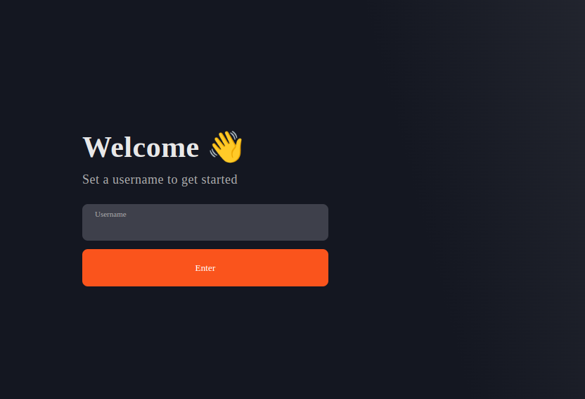
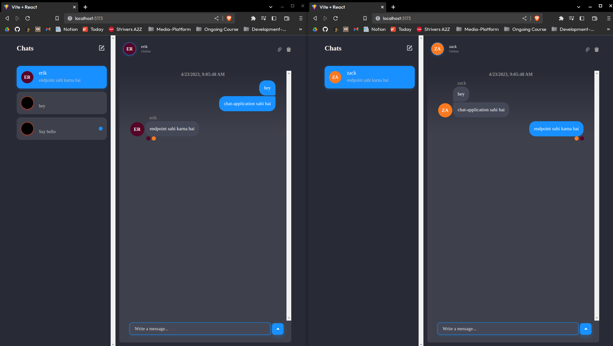

# Realtime-Chat-App
Full-stack, realtime chat app with Node JS, React JS and ChatEngine.io

## Tech-Stack
```
1. React.Js
2. Node.Js
3. Express.Js
4. ChatEngine.io
```

## Setup
```
- Backend [Server]
   1. npm install
   2. npm start

- Frontend [Client]
   1. npm install
   2. npm run dev
```

## Final-Result
<p float="left">
  
   
</p>
